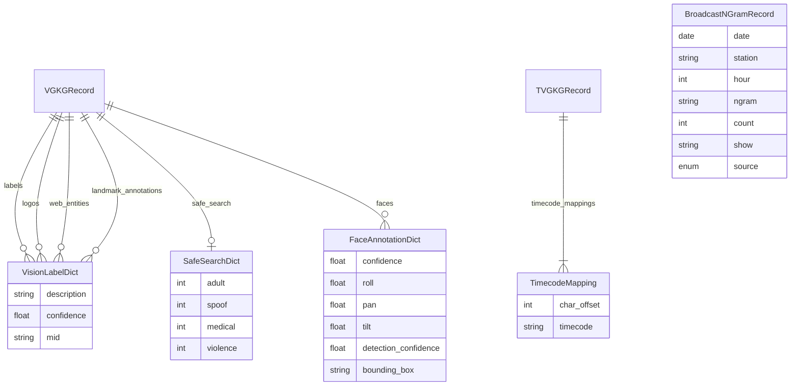

# Feature: Add Missing File-Based Datasets (WS3)

**Priority:** Medium
**Effort:** Medium (new parsers needed)
**Target:** v1.1
**Created:** 2025-01-20
**Updated:** 2026-01-20 (based on real data discovery)

---

## Overview

Implement support for 4 actively-updated GDELT datasets that are available via raw files and BigQuery:

1. **Visual GKG (VGKG)** - Google Cloud Vision API annotations on news images
2. **American TV GKG (TV-GKG)** - GKG 2.0 annotations over TV closed captions
3. **Broadcast NGrams (TV + Radio)** - Word frequency from TV/radio broadcasts

---

## Problem Statement

The py-gdelt library currently supports Events, GKG, Mentions, and Web NGrams datasets. Four significant file-based datasets are missing:

- **VGKG**: No way to access image analysis data (labels, faces, OCR, SafeSearch scores)
- **TV-GKG**: No access to TV closed caption analysis with timecode mapping
- **Broadcast NGrams**: No access to broadcast media word frequency data

These datasets are actively updated and valuable for media analysis research.

---

## Schema Discovery Results

Integration tests (`tests/integration/test_new_datasets_schema_discovery.py`) confirmed actual schemas:

### VGKG - 12 Columns (not 8 as originally documented)

| Index | Column | Format | Example |
|-------|--------|--------|---------|
| 0 | date | YYYYMMDDHHMMSS | 20260120123456 |
| 1 | document_identifier | URL | https://example.com/article |
| 2 | image_url | URL | https://example.com/image.jpg |
| 3 | labels | Label\<FIELD\>Confidence\<FIELD\>MID\<RECORD\>... | Person\<FIELD\>0.95\<FIELD\>/m/01g317\<RECORD\>... |
| 4 | logos | Same format as labels | CNN\<FIELD\>0.92\<FIELD\>/m/019_tv |
| 5 | web_entities | Same format as labels | Entity\<FIELD\>0.85\<FIELD\>/m/0xxx |
| 6 | safe_search | 4 integers separated by \<FIELD\> | -1\<FIELD\>0\<FIELD\>-1\<FIELD\>0 |
| 7 | faces | confidence\<FIELD\>roll\<FIELD\>pan\<FIELD\>tilt\<FIELD\>detection_confidence\<FIELD\>bbox\<RECORD\>... | 0.95\<FIELD\>0.1\<FIELD\>-0.2\<FIELD\>0.05\<FIELD\>0.98\<FIELD\>10,20,100,150 |
| 8 | ocr_text | Plain text | Breaking News... |
| 9 | landmark_annotations | Same format as labels | Eiffel Tower\<FIELD\>0.85\<FIELD\>/m/03000 |
| 10 | domain | Domain name | example.com |
| 11 | raw_json | Full Cloud Vision API JSON (14-30KB) | {"responses":[...]} |

**Key findings:**
- SafeSearch uses integers (-1, 0, 1, etc.), NOT floats 0.0-1.0
- Faces have roll/pan/tilt angles (pose), NOT emotion scores
- `mid` (Knowledge Graph MID) IS present in labels - useful for entity linking
- `bounding_box` IS present in faces - useful for face localization
- `raw_json` column contains full Cloud Vision API response (14-30KB per row)

### TV NGrams - 5 Columns

| Index | Column | Example |
|-------|--------|---------|
| 0 | DATE | 20260120 |
| 1 | STATION | CNN |
| 2 | HOUR | 14 |
| 3 | WORD | president |
| 4 | COUNT | 47 |

### Radio NGrams - 6 Columns

| Index | Column | Example |
|-------|--------|---------|
| 0 | DATE | 20260120 |
| 1 | STATION | KQED |
| 2 | HOUR | 14 |
| 3 | NGRAM | climate |
| 4 | COUNT | 23 |
| 5 | SHOW | Morning Edition |

**Key finding:** TV and Radio NGrams are schema-compatible! Radio adds one optional column (SHOW). We can unify into `BroadcastNGram*` components.

---

## Technical Approach

### Architecture

Following existing patterns in the codebase:

```
GDELTClient
    ├── VGKGEndpoint (new)
    ├── TVGKGEndpoint (new)
    ├── TVNGramsEndpoint (new)
    └── RadioNGramsEndpoint (new)

Each endpoint uses:
    ├── FileSource (downloads from data.gdeltproject.org)
    ├── BigQuerySource (optional fallback)
    ├── DataFetcher (orchestrates sources)
    ├── Parser (TAB-delimited parsing)
    └── Models (_Raw* dataclass + Pydantic public model)
```

### Data Source Details

| Dataset | BigQuery Table | File Pattern | Update Freq | Format |
|---------|---------------|--------------|-------------|--------|
| VGKG v1 | `cloudvision` | `YYYYMMDDHHMMSS.imagetags.csv.gz` | 15 min | TAB + `<FIELD>/<RECORD>` |
| VGKG v2 | `cloudvision_partitioned` | `YYYYMMDDHHMMSS.vgkg.v3.csv.gz` | 60 sec | TAB + `<FIELD>/<RECORD>` |
| TV-GKG | `iatvgkg` | `YYYYMMDD.gkg.csv.gz` | Daily (48h delay) | GKG 2.0 (27 cols) |
| TV NGrams v1 | `iatv_Ngrams` | `YYYYMMDD.{STATION}.{N}gram.txt.gz` | Daily | TAB (5 cols) |
| TV NGrams v2 | `iatv_Ngramsv2` | `{STATION}_{DATE}_{TIME}_{Show}.{N}gram.v2.txt.gz` | 30 min | TAB (6 cols) |
| Radio NGrams | `iaradio_Ngrams` | `{STATION}_{DATE}_{TIME}.{N}gram.txt.gz` | 30 min | TAB (6 cols) |

---

## Implementation Phases

### Phase 1: VGKG Implementation

**Files to create/modify:**

| Component | File | Template |
|-----------|------|----------|
| Internal dataclass | `src/py_gdelt/models/_internal.py` | Add `_RawVGKG` |
| Parser | `src/py_gdelt/parsers/vgkg.py` | Based on `gkg.py` |
| Pydantic models | `src/py_gdelt/models/vgkg.py` | New file |
| Endpoint | `src/py_gdelt/endpoints/vgkg.py` | Based on `gkg.py` |
| Filter | `src/py_gdelt/filters.py` | Add `VGKGFilter` |
| Tests | `tests/unit/test_parsers_vgkg.py`, `tests/unit/test_endpoints_vgkg.py` | New files |

**VGKG Schema (12 columns - verified from real data):**

```python
# src/py_gdelt/models/_internal.py
@dataclass(slots=True)
class _RawVGKG:
    """Internal VGKG record from file parsing.

    Schema verified from real GDELT data on 2026-01-20.
    """
    date: str                      # [0] YYYYMMDDHHMMSS
    document_identifier: str       # [1] Source article URL
    image_url: str                 # [2] Analyzed image URL
    labels: str                    # [3] Label<FIELD>Confidence<FIELD>MID<RECORD>...
    logos: str                     # [4] Same format as labels
    web_entities: str              # [5] Same format as labels
    safe_search: str               # [6] adult<FIELD>spoof<FIELD>medical<FIELD>violence (integers!)
    faces: str                     # [7] confidence<FIELD>roll<FIELD>pan<FIELD>tilt<FIELD>detection_confidence<FIELD>bbox
    ocr_text: str                  # [8] Plain text from OCR
    landmark_annotations: str      # [9] Same format as labels
    domain: str                    # [10] Domain name
    raw_json: str                  # [11] Full Cloud Vision API JSON (14-30KB)
```

**Nested structures using TypedDict (for performance):**

Based on benchmark results (`tests/benchmarks/test_bench_vgkg_parsing.py`), we use TypedDict
for nested structures instead of Pydantic models. This avoids validation overhead when parsing
large VGKG files with many nested labels/faces per row.

```python
# src/py_gdelt/models/vgkg.py
from typing import TypedDict

class VisionLabelDict(TypedDict):
    """Google Cloud Vision label annotation (lightweight)."""
    description: str
    confidence: float
    mid: str | None  # Knowledge Graph MID - useful for entity linking

class SafeSearchDict(TypedDict):
    """SafeSearch detection results.

    Note: Values are integers from Cloud Vision API:
    - UNKNOWN = -1
    - VERY_UNLIKELY = 0
    - UNLIKELY = 1
    - POSSIBLE = 2
    - LIKELY = 3
    - VERY_LIKELY = 4
    """
    adult: int
    spoof: int
    medical: int
    violence: int

class FaceAnnotationDict(TypedDict):
    """Detected face with pose angles (not emotion scores!).

    The face data contains pose information (roll/pan/tilt angles),
    NOT emotion scores as originally assumed.
    """
    confidence: float
    roll: float           # Head roll angle in degrees
    pan: float            # Head pan angle in degrees
    tilt: float           # Head tilt angle in degrees
    detection_confidence: float
    bounding_box: str | None  # Format: "x1,y1,x2,y2"
```

**Main Pydantic model:**

```python
class VGKGRecord(BaseModel):
    """Visual GKG record with Cloud Vision annotations.

    Nested structures (labels, faces, etc.) use TypedDict for performance.
    See tests/benchmarks/test_bench_vgkg_parsing.py for rationale.
    """
    date: datetime
    document_identifier: str
    image_url: str
    labels: list[VisionLabelDict] = Field(default_factory=list)
    logos: list[VisionLabelDict] = Field(default_factory=list)
    web_entities: list[VisionLabelDict] = Field(default_factory=list)
    safe_search: SafeSearchDict | None = None
    faces: list[FaceAnnotationDict] = Field(default_factory=list)
    ocr_text: str = ""
    landmark_annotations: list[VisionLabelDict] = Field(default_factory=list)
    domain: str = ""
    raw_json: str = ""  # Keep as string - users can parse with json.loads() if needed

    @classmethod
    def from_raw(cls, raw: _RawVGKG) -> VGKGRecord:
        """Convert internal dataclass to validated model."""
        ...
```

**Parser with nested delimiter handling:**

```python
# src/py_gdelt/parsers/vgkg.py
class VGKGParser:
    """Parser for VGKG tab-delimited files with nested delimiters."""

    FIELD_DELIM = "<FIELD>"
    RECORD_DELIM = "<RECORD>"
    EXPECTED_COLUMNS = 12  # Updated based on real data

    def parse(self, data: bytes) -> Iterator[_RawVGKG]:
        """Parse VGKG file data."""
        lines = data.decode("utf-8", errors="replace").strip().split("\n")
        for line_num, raw_line in enumerate(lines, start=1):
            line = raw_line.strip()
            if not line:
                continue
            parts = line.split("\t")
            if len(parts) < self.EXPECTED_COLUMNS:
                logger.warning("Skipping malformed line %d: expected %d cols, got %d",
                             line_num, self.EXPECTED_COLUMNS, len(parts))
                continue
            yield _RawVGKG(
                date=parts[0],
                document_identifier=parts[1],
                image_url=parts[2],
                labels=parts[3],
                logos=parts[4],
                web_entities=parts[5],
                safe_search=parts[6],
                faces=parts[7],
                ocr_text=parts[8],
                landmark_annotations=parts[9],
                domain=parts[10],
                raw_json=parts[11] if len(parts) > 11 else "",
            )

    def _parse_labels(self, raw: str) -> list[VisionLabelDict]:
        """Parse Label<FIELD>Confidence<FIELD>MID<RECORD>... format."""
        if not raw:
            return []
        labels: list[VisionLabelDict] = []
        for record in raw.split(self.RECORD_DELIM):
            fields = record.split(self.FIELD_DELIM)
            if len(fields) >= 2:
                labels.append({
                    "description": fields[0],
                    "confidence": float(fields[1]) if fields[1] else 0.0,
                    "mid": fields[2] if len(fields) > 2 else None,
                })
        return labels

    def _parse_safe_search(self, raw: str) -> SafeSearchDict | None:
        """Parse safe_search field (4 integers)."""
        if not raw:
            return None
        fields = raw.split(self.FIELD_DELIM)
        if len(fields) < 4:
            return None
        return {
            "adult": int(fields[0]) if fields[0] else -1,
            "spoof": int(fields[1]) if fields[1] else -1,
            "medical": int(fields[2]) if fields[2] else -1,
            "violence": int(fields[3]) if fields[3] else -1,
        }

    def _parse_faces(self, raw: str) -> list[FaceAnnotationDict]:
        """Parse faces field (roll/pan/tilt angles, NOT emotions)."""
        if not raw:
            return []
        faces: list[FaceAnnotationDict] = []
        for record in raw.split(self.RECORD_DELIM):
            fields = record.split(self.FIELD_DELIM)
            if len(fields) >= 5:
                faces.append({
                    "confidence": float(fields[0]) if fields[0] else 0.0,
                    "roll": float(fields[1]) if fields[1] else 0.0,
                    "pan": float(fields[2]) if fields[2] else 0.0,
                    "tilt": float(fields[3]) if fields[3] else 0.0,
                    "detection_confidence": float(fields[4]) if fields[4] else 0.0,
                    "bounding_box": fields[5] if len(fields) > 5 else None,
                })
        return faces
```

**VGKGFilter:**

```python
# src/py_gdelt/filters.py
class VGKGFilter(BaseModel):
    """Filter for VGKG (Visual GKG) queries."""

    date_range: DateRange
    domain: str | None = None  # Filter by source domain
    min_label_confidence: float = Field(default=0.0, ge=0.0, le=1.0)

    @field_validator("domain")
    @classmethod
    def validate_domain(cls, v: str | None) -> str | None:
        """Normalize domain to lowercase."""
        return v.lower() if v else None
```

**File URL patterns:**

```python
# src/py_gdelt/sources/files.py - Add to FILE_TYPE_PATTERNS
FILE_TYPE_PATTERNS: Final[dict[str, str]] = {
    ...
    "vgkg_v1": ".imagetags.csv.gz",
    "vgkg_v2": ".vgkg.v3.csv.gz",
}

# Base URLs
VGKG_V1_BASE = "http://data.gdeltproject.org/gdeltv2_cloudvision/"
VGKG_V2_BASE = "http://data.gdeltproject.org/gdeltv3/vgkg/"
```

---

### Phase 2: TV-GKG Implementation

**Key insight:** TV-GKG uses standard GKG 2.0 format (27 columns), so we can **reuse the existing GKGParser** with modifications for:
- Handling disabled fields (always empty)
- Extracting CHARTIMECODEOFFSETTOC from Extras column

**Files to create/modify:**

| Component | File | Notes |
|-----------|------|-------|
| Internal dataclass | `src/py_gdelt/models/_internal.py` | Reuse `_RawGKG` |
| Parser | `src/py_gdelt/parsers/gkg.py` | Add TV-GKG handling |
| Pydantic model | `src/py_gdelt/models/gkg.py` | Add `TVGKGRecord` extending `GKGRecord` |
| Endpoint | `src/py_gdelt/endpoints/tv_gkg.py` | New file |
| Filter | `src/py_gdelt/filters.py` | Add `TVGKGFilter` |
| Tests | `tests/unit/test_endpoints_tv_gkg.py` | New file |

**Model (composition, not inheritance):**

Note: Reviewers recommended composition over inheritance to avoid coupling issues.
TVGKGRecord uses composition pattern, not `extends GKGRecord`.

```python
# src/py_gdelt/models/gkg.py
from typing import NamedTuple

class TimecodeMapping(NamedTuple):
    """Character offset to video timecode mapping (lightweight)."""
    char_offset: int
    timecode: str

class TVGKGRecord(BaseModel):
    """TV-GKG record with timecode mapping support.

    Uses composition instead of inheritance from GKGRecord.
    Reuses GKG parsing logic but creates independent model.

    Note: The following GKG fields are always empty in TV-GKG:
    - sharing_image, related_images, social_image_embeds, social_video_embeds
    - quotations, all_names, dates, amounts, translation_info

    Special field:
    - timecode_mappings: Parsed from CHARTIMECODEOFFSETTOC in extras
    """
    # Core GKG fields (subset that's actually populated in TV-GKG)
    gkg_record_id: str
    date: datetime
    source_identifier: str
    document_identifier: str
    themes: list[str] = Field(default_factory=list)
    locations: list[str] = Field(default_factory=list)
    persons: list[str] = Field(default_factory=list)
    organizations: list[str] = Field(default_factory=list)
    tone: float | None = None
    extras: str = ""

    # TV-GKG specific
    timecode_mappings: list[TimecodeMapping] = Field(default_factory=list)

    @classmethod
    def from_raw(cls, raw: _RawGKG) -> TVGKGRecord:
        """Convert raw GKG to TV-GKG with timecode extraction."""
        timecodes = cls._parse_timecode_toc(raw.extras)
        return cls(
            gkg_record_id=raw.gkg_record_id,
            date=_parse_gkg_date(raw.date),
            source_identifier=raw.source_identifier,
            document_identifier=raw.document_identifier,
            themes=_parse_delimited(raw.themes),
            locations=_parse_delimited(raw.locations),
            persons=_parse_delimited(raw.persons),
            organizations=_parse_delimited(raw.organizations),
            tone=float(raw.tone) if raw.tone else None,
            extras=raw.extras or "",
            timecode_mappings=timecodes,
        )

    @staticmethod
    def _parse_timecode_toc(extras: str | None) -> list[TimecodeMapping]:
        """Parse CHARTIMECODEOFFSETTOC:offset:timecode;offset:timecode;...

        Real format discovered: offset:timecode pairs separated by semicolons.
        """
        if not extras:
            return []
        for block in extras.split("<SPECIAL>"):
            if block.startswith("CHARTIMECODEOFFSETTOC:"):
                content = block[len("CHARTIMECODEOFFSETTOC:"):]
                mappings = []
                for entry in content.split(";"):
                    if ":" in entry:
                        parts = entry.split(":", 1)
                        try:
                            mappings.append(TimecodeMapping(
                                char_offset=int(parts[0]),
                                timecode=parts[1],
                            ))
                        except ValueError:
                            continue
                return mappings
        return []
```

**File URL pattern:**

```python
# Daily files only (not 15-minute intervals)
TV_GKG_BASE = "http://data.gdeltproject.org/gdeltv2_iatelevision/"
# Pattern: YYYYMMDD.gkg.csv.gz
```

**48-hour embargo handling (in endpoint, not filter):**

Reviewers noted that embargo logic belongs in the endpoint/fetcher layer, not the filter.
Filters should only describe what data to fetch, not enforce availability constraints.

```python
# src/py_gdelt/endpoints/tv_gkg.py
class TVGKGEndpoint:
    """Endpoint for TV-GKG dataset.

    Note: TV-GKG has a 48-hour embargo. Data for the most recent
    48 hours may not be available.
    """

    EMBARGO_HOURS: Final[int] = 48

    async def stream(self, filter_obj: TVGKGFilter) -> AsyncIterator[TVGKGRecord]:
        """Stream TV-GKG records with embargo warning."""
        self._warn_if_within_embargo(filter_obj.date_range)
        async for raw in self._fetcher.fetch_tv_gkg(filter_obj):
            yield TVGKGRecord.from_raw(raw)

    def _warn_if_within_embargo(self, date_range: DateRange | None) -> None:
        """Log warning if date range falls within embargo window."""
        if not date_range or not date_range.end:
            return
        embargo_cutoff = datetime.now(UTC) - timedelta(hours=self.EMBARGO_HOURS)
        if date_range.end > embargo_cutoff:
            logger.warning(
                "TV-GKG has %d-hour embargo. Data after %s may be unavailable.",
                self.EMBARGO_HOURS,
                embargo_cutoff.strftime("%Y-%m-%d %H:%M"),
            )
```

---

### Phase 3: Unified Broadcast NGrams Implementation (TV + Radio)

**Key insight:** TV NGrams (5 cols) and Radio NGrams (6 cols) have compatible schemas.
The first 5 columns are identical; Radio just adds a SHOW column. We consolidate into
unified `BroadcastNGram*` components.

**Files to create/modify:**

| Component | File | Notes |
|-----------|------|-------|
| Internal dataclass | `src/py_gdelt/models/_internal.py` | Add `_RawBroadcastNGram` (unified) |
| Parser | `src/py_gdelt/parsers/broadcast_ngrams.py` | Single parser for TV + Radio |
| Pydantic model | `src/py_gdelt/models/ngrams.py` | Add `BroadcastNGramRecord` |
| Endpoints | `src/py_gdelt/endpoints/tv_ngrams.py`, `radio_ngrams.py` | Thin wrappers using shared parser |
| Filter | `src/py_gdelt/filters.py` | Add `BroadcastNGramsFilter` |
| Tests | `tests/unit/test_parsers_broadcast_ngrams.py`, `tests/unit/test_endpoints_ngrams.py` | New files |

**Unified Schema (verified from real data):**

```python
# src/py_gdelt/models/_internal.py
@dataclass(slots=True)
class _RawBroadcastNGram:
    """Internal Broadcast NGram record (TV and Radio).

    TV NGrams has 5 columns: DATE, STATION, HOUR, WORD, COUNT
    Radio NGrams has 6 columns: DATE, STATION, HOUR, NGRAM, COUNT, SHOW

    We unify these by making 'show' optional (empty string for TV).
    """
    date: str       # YYYYMMDD
    station: str    # Station identifier (e.g., CNN, KQED)
    hour: str       # 24-hour format (00-23)
    ngram: str      # Word or phrase
    count: str      # Frequency count (string for raw parsing)
    show: str = ""  # Show name (Radio only, empty for TV)


class BroadcastSource(str, Enum):
    """Source type for broadcast NGrams."""
    TV = "tv"
    RADIO = "radio"
```

**Unified Pydantic model:**

```python
# src/py_gdelt/models/ngrams.py
class BroadcastNGramRecord(BaseModel):
    """Broadcast NGram frequency record (TV or Radio).

    Unified model for both TV and Radio NGrams since schemas are compatible.
    """

    date: date
    station: str
    hour: int = Field(ge=0, le=23)
    ngram: str
    count: int = Field(ge=0)
    show: str | None = None  # Radio only (None for TV)
    source: BroadcastSource  # Indicates origin (tv or radio)

    @classmethod
    def from_raw(cls, raw: _RawBroadcastNGram, source: BroadcastSource) -> BroadcastNGramRecord:
        return cls(
            date=datetime.strptime(raw.date, "%Y%m%d").date(),
            station=raw.station,
            hour=int(raw.hour),
            ngram=raw.ngram,
            count=int(raw.count),
            show=raw.show if raw.show else None,
            source=source,
        )


# Type aliases for clarity in endpoint signatures
TVNGramRecord = BroadcastNGramRecord
RadioNGramRecord = BroadcastNGramRecord
```

**Unified Parser:**

```python
# src/py_gdelt/parsers/broadcast_ngrams.py
class BroadcastNGramsParser:
    """Parser for TV and Radio NGrams (unified).

    TV NGrams: 5 columns (DATE, STATION, HOUR, WORD, COUNT)
    Radio NGrams: 6 columns (DATE, STATION, HOUR, NGRAM, COUNT, SHOW)
    """

    def parse(self, data: bytes, source: BroadcastSource) -> Iterator[_RawBroadcastNGram]:
        """Parse broadcast NGrams file data."""
        lines = data.decode("utf-8", errors="replace").strip().split("\n")
        min_cols = 5  # TV has 5, Radio has 6

        for line_num, raw_line in enumerate(lines, start=1):
            line = raw_line.strip()
            if not line:
                continue
            parts = line.split("\t")
            if len(parts) < min_cols:
                logger.warning("Skipping malformed line %d: expected >= %d cols, got %d",
                             line_num, min_cols, len(parts))
                continue

            yield _RawBroadcastNGram(
                date=parts[0],
                station=parts[1],
                hour=parts[2],
                ngram=parts[3],
                count=parts[4],
                show=parts[5] if len(parts) > 5 else "",
            )
```

**Filter with N-gram size selection:**

```python
# src/py_gdelt/filters.py
class BroadcastNGramsFilter(BaseModel):
    """Filter for TV/Radio NGrams queries."""

    date_range: DateRange
    station: str | None = None
    show: str | None = None
    ngram_size: int = Field(default=1, ge=1, le=5)  # 1-5 grams

    @field_validator("station")
    @classmethod
    def validate_station(cls, v: str | None) -> str | None:
        """Normalize station name to uppercase."""
        return v.upper() if v else None


# Type aliases for clarity
TVNGramsFilter = BroadcastNGramsFilter
RadioNGramsFilter = BroadcastNGramsFilter
```

**File URL patterns:**

```python
# TV NGrams
TV_NGRAMS_BASE = "http://data.gdeltproject.org/gdeltv3/iatv/ngrams/"
# v1 Pattern: via FILELIST-{STATION}.TXT inventory files
# v2 Pattern: via daily inventory files

# Radio NGrams
RADIO_NGRAMS_BASE = "http://data.gdeltproject.org/gdeltv3/iaradio/ngrams/"
# Pattern: via daily YYYYMMDD.txt inventory files
```

---

### Phase 4: Integration & Client Wiring

**Update GDELTClient:**

```python
# src/py_gdelt/client.py
class GDELTClient:
    """Main GDELT client with all endpoints."""

    @property
    def vgkg(self) -> VGKGEndpoint:
        """Visual GKG endpoint for image annotations."""
        if self._vgkg is None:
            self._vgkg = VGKGEndpoint(
                file_source=self._file_source,
                bigquery_source=self._bigquery_source,
            )
        return self._vgkg

    @property
    def tv_gkg(self) -> TVGKGEndpoint:
        """American TV GKG endpoint for TV closed caption analysis."""
        if self._tv_gkg is None:
            self._tv_gkg = TVGKGEndpoint(
                file_source=self._file_source,
                bigquery_source=self._bigquery_source,
            )
        return self._tv_gkg

    @property
    def tv_ngrams(self) -> TVNGramsEndpoint:
        """TV NGrams endpoint for broadcast word frequency."""
        if self._tv_ngrams is None:
            self._tv_ngrams = TVNGramsEndpoint(
                file_source=self._file_source,
                bigquery_source=self._bigquery_source,
            )
        return self._tv_ngrams

    @property
    def radio_ngrams(self) -> RadioNGramsEndpoint:
        """Radio NGrams endpoint for radio broadcast word frequency."""
        if self._radio_ngrams is None:
            self._radio_ngrams = RadioNGramsEndpoint(
                file_source=self._file_source,
                bigquery_source=self._bigquery_source,
            )
        return self._radio_ngrams
```

**Update FileSource:**

```python
# src/py_gdelt/sources/files.py
FILE_TYPE_PATTERNS: Final[dict[str, str]] = {
    "export": ".export.CSV.zip",
    "mentions": ".mentions.CSV.zip",
    "gkg": ".gkg.csv.zip",
    "ngrams": ".webngrams.json.gz",
    # New patterns
    "vgkg_v1": ".imagetags.csv.gz",
    "vgkg_v2": ".vgkg.v3.csv.gz",
    "tv_gkg": ".gkg.csv.gz",  # Daily files
    "tv_ngrams_v1": ".{N}gram.txt.gz",
    "tv_ngrams_v2": ".{N}gram.v2.txt.gz",
    "radio_ngrams": ".{N}gram.txt.gz",
}

# Base URLs for new datasets
DATASET_BASE_URLS: Final[dict[str, str]] = {
    "vgkg_v1": "http://data.gdeltproject.org/gdeltv2_cloudvision/",
    "vgkg_v2": "http://data.gdeltproject.org/gdeltv3/vgkg/",
    "tv_gkg": "http://data.gdeltproject.org/gdeltv2_iatelevision/",
    "tv_ngrams_v1": "http://data.gdeltproject.org/gdeltv3/iatv/ngrams/",
    "tv_ngrams_v2": "http://data.gdeltproject.org/gdeltv3/iatv/ngramsv2/",
    "radio_ngrams": "http://data.gdeltproject.org/gdeltv3/iaradio/ngrams/",
}
```

**Update DataFetcher:**

```python
# src/py_gdelt/sources/fetcher.py
class DataFetcher:
    """Orchestrates file and BigQuery sources with fallback."""

    async def fetch_vgkg(self, filter_obj: VGKGFilter) -> AsyncIterator[_RawVGKG]:
        """Fetch VGKG records."""
        ...

    async def fetch_tv_gkg(self, filter_obj: TVGKGFilter) -> AsyncIterator[_RawGKG]:
        """Fetch TV-GKG records (uses GKG parser)."""
        ...

    async def fetch_broadcast_ngrams(
        self,
        filter_obj: BroadcastNGramsFilter,
        source: BroadcastSource,
    ) -> AsyncIterator[_RawBroadcastNGram]:
        """Fetch Broadcast NGram records (TV or Radio).

        Args:
            filter_obj: Filter criteria for the query
            source: BroadcastSource.TV or BroadcastSource.RADIO
        """
        ...
```

---

## Implementation Strategy

### Recommended Order

1. **Phase 3 (Broadcast NGrams)** - Start here
   - Simplest schema (5-6 columns, no nested delimiters)
   - Good warmup for the codebase patterns
   - Quick win to validate approach

2. **Phase 1 (VGKG)** - Most complex
   - 12 columns with nested `<FIELD>`/`<RECORD>` delimiters
   - TypedDict parsing for performance
   - Largest test surface area

3. **Phase 2 (TV-GKG)** - Reuses existing code
   - Leverages existing GKG parser
   - Adds timecode extraction
   - Embargo warning logic

4. **Phase 4 (Integration)** - Final wiring
   - Connect all endpoints to GDELTClient
   - Update exports and __init__.py files
   - End-to-end integration tests

### Parallel Execution Opportunities

The following tasks can be executed by **parallel subagents**:

#### Wave 1: Independent Components (fully parallel)
```
┌─────────────────────────────────────────────────────────────────┐
│  PARALLEL WAVE 1 - No dependencies between these               │
├─────────────────────────────────────────────────────────────────┤
│  Agent A: _RawBroadcastNGram + BroadcastNGramsParser           │
│           (models/_internal.py, parsers/broadcast_ngrams.py)    │
│                                                                 │
│  Agent B: _RawVGKG + VGKGParser                                │
│           (models/_internal.py, parsers/vgkg.py)               │
│                                                                 │
│  Agent C: VGKGFilter + TVGKGFilter + BroadcastNGramsFilter     │
│           (filters.py)                                          │
└─────────────────────────────────────────────────────────────────┘
```

#### Wave 2: Models (depends on Wave 1 dataclasses)
```
┌─────────────────────────────────────────────────────────────────┐
│  PARALLEL WAVE 2 - Depends on _Raw* dataclasses from Wave 1    │
├─────────────────────────────────────────────────────────────────┤
│  Agent A: BroadcastNGramRecord                                  │
│           (models/ngrams.py)                                    │
│                                                                 │
│  Agent B: VGKGRecord + TypedDicts                              │
│           (models/vgkg.py)                                      │
│                                                                 │
│  Agent C: TVGKGRecord + TimecodeMapping                        │
│           (models/gkg.py additions)                             │
└─────────────────────────────────────────────────────────────────┘
```

#### Wave 3: Endpoints (depends on Wave 2 models)
```
┌─────────────────────────────────────────────────────────────────┐
│  PARALLEL WAVE 3 - Depends on models from Wave 2               │
├─────────────────────────────────────────────────────────────────┤
│  Agent A: TVNGramsEndpoint + RadioNGramsEndpoint               │
│           (endpoints/tv_ngrams.py, endpoints/radio_ngrams.py)   │
│                                                                 │
│  Agent B: VGKGEndpoint                                          │
│           (endpoints/vgkg.py)                                   │
│                                                                 │
│  Agent C: TVGKGEndpoint                                         │
│           (endpoints/tv_gkg.py)                                 │
└─────────────────────────────────────────────────────────────────┘
```

#### Wave 4: Integration (depends on all endpoints)
```
┌─────────────────────────────────────────────────────────────────┐
│  SEQUENTIAL WAVE 4 - Wiring everything together                │
├─────────────────────────────────────────────────────────────────┤
│  Single Agent: GDELTClient updates, FileSource patterns,       │
│                DataFetcher methods, __init__.py exports         │
└─────────────────────────────────────────────────────────────────┘
```

#### Test Waves (can parallel with corresponding implementation)
```
┌─────────────────────────────────────────────────────────────────┐
│  PARALLEL TEST AGENTS - Run alongside implementation waves     │
├─────────────────────────────────────────────────────────────────┤
│  Test Agent A: test_parsers_broadcast_ngrams.py                │
│  Test Agent B: test_parsers_vgkg.py                            │
│  Test Agent C: test_endpoints_*.py (after Wave 3)              │
└─────────────────────────────────────────────────────────────────┘
```

### Summary: Maximum Parallelization

| Wave | Agents | Components | Depends On |
|------|--------|------------|------------|
| 1 | 3 parallel | Parsers, Filters, Raw dataclasses | Nothing |
| 2 | 3 parallel | Pydantic models | Wave 1 |
| 3 | 3 parallel | Endpoints | Wave 2 |
| 4 | 1 sequential | Client integration | Wave 3 |

**Total: 10 agents across 4 waves** (vs 10 sequential tasks)

---

## Acceptance Criteria

### Functional Requirements

- [ ] VGKG endpoint can query and stream Visual GKG records
- [ ] VGKG parser handles `<FIELD>` and `<RECORD>` delimiters correctly
- [ ] VGKG models expose labels, logos, SafeSearch scores, faces, OCR text
- [ ] TV-GKG endpoint can query TV closed caption annotations
- [ ] TV-GKG extracts CHARTIMECODEOFFSETTOC timecode mappings
- [ ] TV-GKG warns when querying within 48-hour embargo window
- [ ] TV NGrams endpoint supports station and show filtering
- [ ] TV NGrams endpoint supports N-gram size selection (1-5)
- [ ] Radio NGrams endpoint supports station filtering
- [ ] Radio NGrams endpoint supports N-gram size selection (1-5)
- [ ] All endpoints support both async and sync interfaces
- [ ] All endpoints support BigQuery fallback when file source fails

### Non-Functional Requirements

- [ ] All parsers handle malformed lines gracefully (log warning, skip line)
- [ ] All parsers use generator-based iteration for memory efficiency
- [ ] All models use internal `_Raw*` dataclasses for parsing performance
- [ ] All code passes `make ci` (lint + typecheck + tests)
- [ ] Test coverage >= 90% for new code
- [ ] Google-style docstrings on all public classes and methods

---

## Dependencies & Risks

### Dependencies

- Existing `FileSource`, `BigQuerySource`, `DataFetcher` infrastructure
- Existing `GKGParser` (can be reused for TV-GKG)
- Access to sample files for testing

### Risks

| Risk | Mitigation |
|------|------------|
| VGKG delimiter format may vary | Download sample files, test with real data |
| TV-GKG timecode format undocumented | Inspect actual files, make parser lenient |
| NGrams file discovery complex (station-based naming) | Use daily inventory files when available |
| BigQuery table schemas may differ from file schemas | Test both sources, normalize in models |

---

## File Summary

### New Files to Create

```
src/py_gdelt/
├── parsers/
│   ├── vgkg.py              # VGKG parser with nested delimiters (TypedDict output)
│   └── broadcast_ngrams.py  # Unified TV/Radio NGrams parser
├── models/
│   └── vgkg.py              # VGKGRecord, VisionLabelDict, SafeSearchDict, FaceAnnotationDict
├── endpoints/
│   ├── vgkg.py              # VGKGEndpoint
│   ├── tv_gkg.py            # TVGKGEndpoint (with embargo warning)
│   ├── tv_ngrams.py         # TVNGramsEndpoint (thin wrapper)
│   └── radio_ngrams.py      # RadioNGramsEndpoint (thin wrapper)

tests/unit/
├── test_parsers_vgkg.py
├── test_parsers_broadcast_ngrams.py
├── test_endpoints_vgkg.py
├── test_endpoints_tv_gkg.py
└── test_endpoints_ngrams.py    # Tests both TV and Radio (unified)

tests/benchmarks/
└── test_bench_vgkg_parsing.py  # Benchmark comparing Pydantic vs TypedDict vs NamedTuple
```

### Existing Files to Modify

```
src/py_gdelt/
├── models/
│   ├── __init__.py          # Export new models
│   ├── _internal.py         # Add _RawVGKG, _RawBroadcastNGram
│   ├── gkg.py               # Add TVGKGRecord, TimecodeMapping (composition pattern)
│   └── ngrams.py            # Add BroadcastNGramRecord (unified TV/Radio)
├── parsers/
│   └── __init__.py          # Export new parsers
├── endpoints/
│   └── __init__.py          # Export new endpoints
├── sources/
│   ├── files.py             # Add new file type patterns and base URLs
│   └── fetcher.py           # Add fetch_vgkg, fetch_tv_gkg, fetch_broadcast_ngrams
├── filters.py               # Add VGKGFilter, TVGKGFilter, BroadcastNGramsFilter
└── client.py                # Add vgkg, tv_gkg, tv_ngrams, radio_ngrams properties
```

---

## ERD: New Model Relationships



Note:
- `VisionLabelDict`, `SafeSearchDict`, `FaceAnnotationDict` are TypedDicts (not Pydantic models)
- `TVGKGRecord` uses composition, not inheritance from `GKGRecord`
- `BroadcastNGramRecord` is unified for both TV and Radio NGrams

---

## References

### Internal References

- Endpoint pattern: `src/py_gdelt/endpoints/gkg.py:1`
- Parser pattern: `src/py_gdelt/parsers/gkg.py:1`
- Internal dataclass pattern: `src/py_gdelt/models/_internal.py:1`
- FileSource patterns: `src/py_gdelt/sources/files.py:1`
- DataFetcher integration: `src/py_gdelt/sources/fetcher.py:1`

### External References

- [GDELT Visual GKG Documentation](https://blog.gdeltproject.org/gdelt-visual-knowledge-graph-vgkg-v1-0-available/)
- [VGKG 2.0 Release Notes](https://blog.gdeltproject.org/vgkg-2-0-released/)
- [American TV GKG Announcement](https://blog.gdeltproject.org/announcing-the-american-television-global-knowledge-graph-tv-gkg/)
- [TV NGrams Dataset Documentation](https://blog.gdeltproject.org/announcing-the-television-news-ngram-datasets-tv-ngram/)
- [TV NGrams 2.0 Dataset](https://blog.gdeltproject.org/announcing-the-television-news-ngram-2-0-dataset/)
- [Radio NGrams Dataset](https://blog.gdeltproject.org/announcing-the-radio-news-ngram-dataset/)
- [Google Cloud Vision API Labels](https://cloud.google.com/vision/docs/labels)

---

## Open Questions

Status updated based on schema discovery tests (`tests/integration/test_new_datasets_schema_discovery.py`):

1. ✅ **VGKG delimiter format**: CONFIRMED - Uses `<FIELD>` and `<RECORD>` delimiters. 12 columns (not 8).
2. ✅ **TV-GKG CHARTIMECODEOFFSETTOC format**: CONFIRMED - Format is `offset:timecode;offset:timecode;...`
3. ✅ **TV/Radio NGrams schema compatibility**: CONFIRMED - Compatible. TV has 5 cols, Radio has 6 (adds SHOW).
4. ⏳ **Station name validation**: Deferred - No lookup table needed initially; validate against inventory files at runtime
5. ⏳ **BigQuery table partitioning**: To be documented during BigQuery source implementation

### Answered Questions from Schema Discovery

- **VGKG faces have emotions?** NO - faces have roll/pan/tilt (pose angles), not emotion scores
- **SafeSearch uses floats?** NO - uses integers (-1 = UNKNOWN, 0-4 = likelihood levels)
- **Are `mid` and `bounding_box` YAGNI?** NO - both are present in real data and useful
